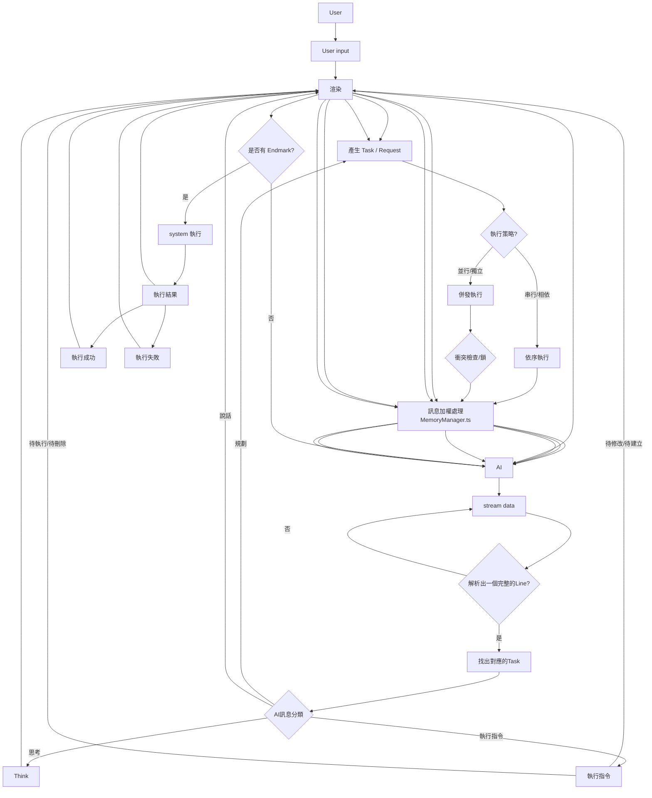

```mermaid
flowchart TD
    U1[User] --> U2[User input] --> R1[渲染] --> T1[產生 Task / Request]
    T1 --> TS{執行策略?}
    TS -- 串行/相依 --> TS1[依序執行] --> M1[訊息加權處理MemoryManager.ts] --> AI1
    TS -- 並行/獨立 --> TP1[併發執行] --> LOCK{衝突檢查/鎖} --> M1 --> AI1
    
    AI1[AI] --> AI2[stream data] --> CHUNK{解析出一個完整的Line?}
    CHUNK -- 否 --> AI2
    CHUNK -- 是 --> TN[找出對應的Task] --> T2{AI訊息分類}
    T2 -- 思考 --> T3[Think] --> R1 --> M1 --> AI1
    T2 -- 規劃 --> T1
    T2 -- 說話 --> R1 --> T1
    T2 -- 執行指令 --> E1[執行指令] -- 待修改/待建立 --> R1 --> DATAREADY{是否有 Endmark?}
    E1[執行指令] -- 待執行/待刪除 --> R1 --> AI1

    DATAREADY -- 是 --> RUN[system 執行] --> RESULT[執行結果] --> R1 --> M1 --> AI1
    DATAREADY -- 否 --> AI1   
    
    RESULT --> SUCCESS[執行成功] --> R1 --> M1 --> AI1
    RESULT --> FAIL[執行失敗] --> R1 --> M1 --> AI1
```

